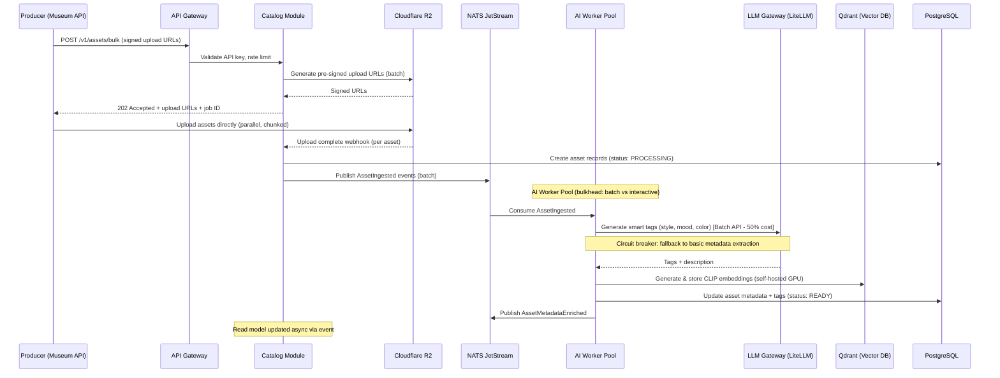
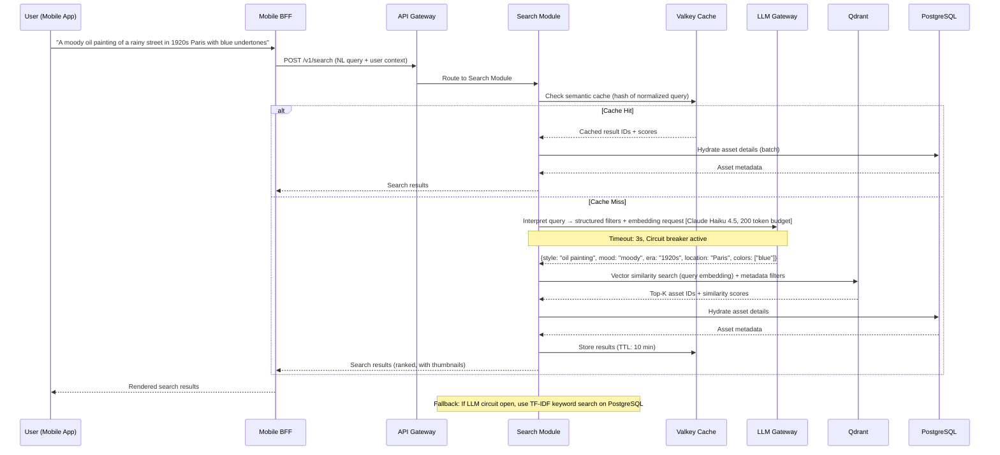
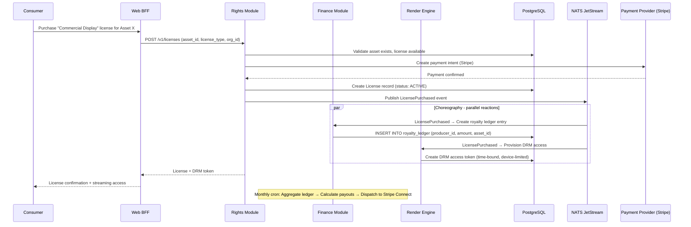
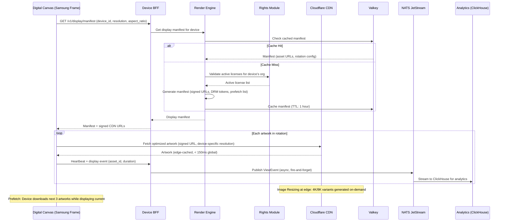
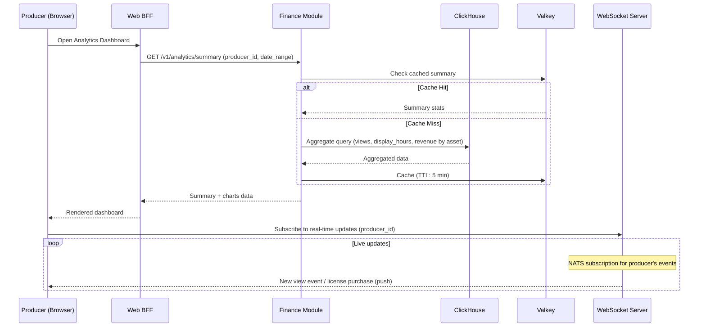

# Project Aura — Architecture Blueprint v1.0

> **Audience:** Engineering leadership, platform team, infrastructure & DevOps
> **Status:** Proposed
> **Date:** 2026-03-10
> **Scale target:** 100 M+ consumers, 1 M+ producers, 1 M+ concurrent streams, petabyte-scale storage

---

## Table of Contents

1. [Overview & Driving Constraints](#1-overview--driving-constraints)
2. [Critical Technology Stack Choices](#2-critical-technology-stack-choices)
3. [Architectural Style & Modular Decomposition](#3-architectural-style--modular-decomposition)
4. [Key Design Patterns & Architectural Constructs](#4-key-design-patterns--architectural-constructs)
5. [Critical Path Sequence & Data Flow Diagrams](#5-critical-path-sequence--data-flow-diagrams)
6. [Resilience, Observability & Cost Safeguards](#6-resilience-observability--cost-safeguards)
7. [Parallel Development & Testability Blueprint](#7-parallel-development--testability-blueprint)
8. [Architecture Decision Records (ADRs)](#8-architecture-decision-records-adrs)
9. [Ambiguities & Working Assumptions](#9-ambiguities--working-assumptions)

---

## 1. Overview & Driving Constraints

Aura is a **high-fidelity digital art ecosystem** for curating, licensing, and rendering professional-grade artwork and video. It serves two sides of a marketplace:

- **Producers (1 M+):** Artists, museums, 3P developers, and corporate marketing teams uploading and licensing artwork.
- **Consumers (100 M+):** Art lovers, interior designers, and corporate clients discovering, licensing, and displaying art across a wide array of devices.

### Non-Functional Targets

| Metric | Target |
|---|---|
| Availability | 99.95 % uptime (≈ 22 min downtime/month) |
| API Latency (p95) | < 400 ms |
| Global Read Latency (CDN edge) | < 150 ms |
| Concurrent Streams | 1 M+ |
| Storage | Petabyte-scale |
| Cost Predictability | Linear cost growth per MAU cohort; LLM costs capped via quotas |

### Core Architecture Principles

1. **Cost predictability over peak throughput** — AI/LLM calls and high-res media delivery are the two largest cost drivers; both must have hard budgets and graceful degradation.
2. **Multi-vendor portability** — No 100 % single-cloud lock-in; use open standards (OCI, S3-compatible, OpenTelemetry).
3. **Evolvability** — Swap AI models/providers every 12–18 months without rewriting core domain logic.
4. **Horizontal scalability** — Cell-based deployment to scale regions independently.
5. **Developer velocity** — Contract-first APIs, mock servers, and parallel team development from Day 1.

---

## 2. Critical Technology Stack Choices

### Decision 1: Backend Language & Runtime

| Criterion (Weight) | Go | Rust | TypeScript (Node/Bun) | Java 21+ (Virtual Threads) |
|---|---|---|---|---|
| **Cost @ 10 M MAU** (40 %) | Low — small binaries, low memory | Lowest — zero-cost abstractions | Medium — higher memory per instance | Medium — JVM overhead, offset by maturity |
| **Performance & Scale** (30 %) | Excellent concurrency (goroutines) | Best raw throughput | Good with event loop; CPU-bound work weaker | Excellent with virtual threads |
| **Dev Velocity & Ecosystem** (20 %) | Good — fast compile, solid stdlib | Slow compile, steep curve | Excellent — massive ecosystem, shared w/ frontend | Good — huge enterprise ecosystem |
| **Lock-in / Migration Risk** (10 %) | Low | Low | Low | Medium (JVM ecosystem gravity) |
| **Weighted Score** | **8.2** | 7.4 | 7.6 | 7.0 |

**Recommendation: Go** — best balance of cost efficiency, concurrency model (goroutines are ideal for I/O-heavy services like media proxying and LLM calls), fast compile times, and small deployment footprint. TypeScript is a close second and may be used for BFF layers to share types with web frontend.

---

### Decision 2: API Style

| Criterion (Weight) | GraphQL (+ Federation) | REST + OpenAPI 3.1 | gRPC (internal) + REST (public) | tRPC |
|---|---|---|---|---|
| **Cost @ scale** (40 %) | Medium — query complexity can spike; requires persisted queries | Low — cacheable, simple | Low internal; REST gateway adds overhead | Low |
| **Performance** (30 %) | Good with DataLoader; overfetching eliminated | Good — HTTP caching works well | Best for internal; binary protocol | Good |
| **Dev Velocity** (20 %) | Excellent — schema-first, self-documenting | Good — well-understood | Good internal; dual maintenance | Excellent — but TS-only |
| **Mobile/Offline/Device Support** (10 %) | Good — single endpoint, partial queries | Excellent — universal | Poor for external clients | Poor — TS-only |
| **Weighted Score** | 7.5 | **8.0** | 7.2 | 6.0 |

**Recommendation: REST + OpenAPI 3.1 for public API; gRPC for internal service-to-service communication.** Rationale: Aura serves Smart TVs, digital canvases (Meural, Samsung Frame), and native mobile — REST is universally supported. gRPC gives us efficient internal communication with strong typing via Protobuf. OpenAPI enables contract-first development and auto-generated client SDKs.

---

### Decision 3: Primary Database(s)

| Criterion (Weight) | PostgreSQL (Citus/partitioned) | CockroachDB | DynamoDB | Vitess (MySQL) |
|---|---|---|---|---|
| **Cost @ 10 M MAU** (40 %) | Low — open-source, well-optimized | Medium — CockroachDB Cloud pricing | High — unpredictable at scale w/ hot keys | Low — open-source |
| **Performance** (30 %) | Excellent — JSONB, full-text, GIN indexes | Excellent — distributed SQL | Excellent — single-digit ms reads | Good |
| **Ecosystem** (20 %) | Best — massive extension ecosystem | Good — Postgres-compatible wire | Good — AWS-native | Good — Slack/YouTube proven |
| **Lock-in Risk** (10 %) | Lowest | Low (CockroachDB is open-core) | High (AWS-only) | Low |
| **Weighted Score** | **8.6** | 7.6 | 6.4 | 7.2 |

**Recommendation: PostgreSQL** with Citus extension for horizontal sharding. Rationale: rich data model (JSONB for flexible metadata), excellent full-text search as a complement to vector search, lowest cost, zero lock-in. Shard by `tenant_id` (producer/organization) for the producer-side and by `user_id` for consumer-side.

**Secondary stores:**
- **Vector DB:** Qdrant (self-hosted, open-source) for semantic search embeddings (image and text). Milvus and Pinecone were considered; Qdrant wins on cost (no per-vector pricing) and Rust-based performance.
- **Time-series / Analytics:** ClickHouse for the royalty analytics dashboard and display-hours tracking. Column-oriented, excellent compression, open-source.

---

### Decision 4: Caching Layer

| Criterion (Weight) | Redis (Valkey) | Memcached | DragonflyDB | KeyDB |
|---|---|---|---|---|
| **Cost** (40 %) | Low — Valkey is OSS fork | Low | Medium | Low |
| **Features** (30 %) | Best — pub/sub, sorted sets, streams, Lua | Basic KV only | Redis-compatible, multi-threaded | Redis-compatible, multi-threaded |
| **Performance** (20 %) | Excellent | Excellent for simple KV | Excellent (25× throughput claims) | Good |
| **Ecosystem** (10 %) | Best — universal client support | Good | Growing | Small |
| **Weighted Score** | **8.4** | 6.2 | 7.4 | 6.8 |

**Recommendation: Valkey (Redis OSS fork)** — we need sorted sets for trending feeds, pub/sub for real-time display updates, and streams for lightweight event distribution. Valkey avoids Redis Ltd. licensing concerns. Tiered caching: L1 in-process (Ristretto for Go services), L2 Valkey cluster.

---

### Decision 5: AI/LLM Serving Strategy

| Criterion (Weight) | Self-hosted (vLLM / TGI) | Claude API (Anthropic) | OpenAI API | Multi-provider Gateway (LiteLLM) |
|---|---|---|---|---|
| **Cost @ 100 M queries/month** (40 %) | Lowest long-term (GPU amortized) | Medium — token-based | Medium-High | Depends on backend |
| **Quality** (30 %) | Depends on model | Best for reasoning/tagging | Excellent | Best of all providers |
| **Operational Complexity** (20 %) | High — GPU fleet management | Low — fully managed | Low — fully managed | Low — thin proxy |
| **Vendor Flexibility** (10 %) | Full control | Single vendor | Single vendor | **Best — swap providers** |
| **Weighted Score** | 7.0 | 7.6 | 7.2 | **8.0** |

**Recommendation: Multi-provider gateway (LiteLLM or custom gateway) backed by Claude API as the primary provider, with OpenAI as failover.** Rationale:

- **Smart tagging & metadata enrichment** (style, mood, color palette) are batch-processable — use Anthropic Batches API for 50 % cost reduction.
- **Natural-language search query understanding** ("describe it" feature) is latency-sensitive — route to Claude Haiku 4.5 for speed, fall back to cached embeddings.
- **Image-to-text embeddings** for visual similarity — use CLIP (self-hosted on GPU) for embedding generation; this is a fixed-cost workload that doesn't benefit from API pricing.
- The gateway pattern decouples domain logic from any single provider, future-proofing for model upgrades every 12–18 months.

**Cost Controls:**
- Semantic caching (hash query + top-K context → cache LLM response in Valkey with TTL).
- Token budget per request type (tag generation: 500 tokens max, search interpretation: 200 tokens max).
- Priority queuing: paid/commercial license queries get priority; free-tier queries are rate-limited.

---

### Decision 6: Media Delivery & CDN

| Criterion (Weight) | CloudFront + S3 | Cloudflare R2 + Stream | Bunny CDN + Backblaze B2 | Fastly + MinIO |
|---|---|---|---|---|
| **Cost @ PB scale** (40 %) | High (S3 egress) | **Lowest (zero egress R2)** | Low | Medium |
| **Performance** (30 %) | Excellent — global PoPs | Excellent — Anycast | Good — growing network | Excellent — edge compute |
| **Features** (20 %) | Mature — Lambda@Edge | Good — Workers for transform | Basic | Excellent — Compute@Edge |
| **DRM Support** (10 %) | Good — signed URLs + cookies | Basic — signed URLs | Basic | Good |
| **Weighted Score** | 7.0 | **8.4** | 7.2 | 7.0 |

**Recommendation: Cloudflare R2 (storage) + Cloudflare Stream (video) + Cloudflare CDN.** Rationale: Zero egress fees are transformative at petabyte scale — egress is typically 60–80 % of media delivery cost. Cloudflare Workers enable edge-side image transformation (dynamic resolution scaling for different devices). For DRM, we layer signed URLs with time-limited tokens + watermarking via Workers.

**Adaptive Rendering Pipeline:**
- Stills: Original stored in R2 → Cloudflare Image Resizing (on-the-fly 4K/8K/aspect-ratio variants) → edge-cached.
- Video: Upload to Cloudflare Stream → adaptive bitrate HLS/DASH → edge delivery.
- Digital Canvas devices: Dedicated manifest endpoint returns device-optimized format (resolution, color profile, aspect ratio).

---

### Decision 7: Message Broker / Event Backbone

| Criterion (Weight) | Apache Kafka (self-managed) | Confluent Cloud | NATS JetStream | Redpanda |
|---|---|---|---|---|
| **Cost** (40 %) | Low (infra mgmt cost) | High | **Lowest** | Low |
| **Throughput** (30 %) | Excellent | Excellent | Excellent | Excellent (Kafka-compatible) |
| **Operational Ease** (20 %) | Low — ZooKeeper/KRaft | Excellent — managed | **Excellent — single binary** | Good |
| **Ecosystem** (10 %) | Best — Connect, Streams, Schema Registry | Best — fully managed | Growing | Good — Kafka-compatible |
| **Weighted Score** | 6.8 | 7.0 | **8.0** | 7.6 |

**Recommendation: NATS JetStream** for the event backbone. Rationale: Single-binary deployment, built-in persistence, excellent Go SDK, and lowest operational overhead. For our workload (domain events, job orchestration, analytics streaming), NATS JetStream provides sufficient ordering and durability guarantees. Schema validation handled at the application layer using Protobuf or JSON Schema with a lightweight registry.

**Fallback consideration:** If we need Kafka Connect ecosystem (e.g., CDC from PostgreSQL to ClickHouse), deploy Redpanda as a dedicated data pipeline alongside NATS for domain events.

---

### Decision 8: Observability Backbone

| Criterion (Weight) | Grafana Stack (LGTM) | Datadog | New Relic | AWS CloudWatch + X-Ray |
|---|---|---|---|---|
| **Cost @ scale** (40 %) | **Lowest — OSS** | Very High | High | Medium but unpredictable |
| **Capability** (30 %) | Excellent — Loki, Tempo, Mimir, Pyroscope | Best-in-class | Excellent | Good |
| **OpenTelemetry Native** (20 %) | Excellent | Good | Good | Partial |
| **Lock-in** (10 %) | None | High | High | High (AWS) |
| **Weighted Score** | **8.8** | 6.8 | 6.6 | 5.8 |

**Recommendation: Grafana LGTM stack** (Loki for logs, Grafana for dashboards, Tempo for traces, Mimir for metrics) with OpenTelemetry (OTel) as the instrumentation standard. Rationale: Lowest cost at our scale (Datadog would cost millions/year at 100 M MAU), full OTel compatibility means zero vendor lock-in, and the stack is battle-tested.

---

## 3. Architectural Style & Modular Decomposition

### 3.1 Paradigm: Modular Monolith → Microservices (Evolutionary)

We adopt a **modular monolith** for the initial launch, with clearly defined module boundaries that can be extracted into independent services as scale demands. This balances developer velocity (single deployable, shared DB transactions) with future evolvability.

**Justification:**
- At launch, team size is likely < 30 engineers — microservices overhead (service mesh, distributed tracing complexity, deployment orchestration) would slow velocity.
- Module boundaries are enforced via Go packages with explicit public APIs (exported interfaces only).
- The modular monolith deploys as 2–3 binaries: **API server**, **Worker (async jobs)**, and **Stream server (media/WebSocket)**.
- Extraction trigger: when a module's team grows to 6+ engineers or its scaling profile diverges (e.g., the rendering engine needs GPU nodes).

### 3.2 Domain Decomposition

```
┌─────────────────────────────────────────────────────────────────┐
│                        API Gateway / BFF                        │
│              (Rate limiting, Auth, Request routing)              │
└────────┬──────────┬──────────┬──────────┬──────────┬────────────┘
         │          │          │          │          │
    ┌────▼───┐ ┌────▼───┐ ┌───▼────┐ ┌──▼───┐ ┌───▼──────┐
    │Catalog │ │Search  │ │Render  │ │Rights│ │  Finance │
    │Module  │ │Module  │ │Engine  │ │& DRM │ │  Module  │
    └────┬───┘ └────┬───┘ └───┬────┘ └──┬───┘ └───┬──────┘
         │          │         │         │          │
    ┌────▼──────────▼─────────▼─────────▼──────────▼──────┐
    │              Core Domain Layer                       │
    │  (Art Asset, License, Producer, Consumer, Display)   │
    └────┬──────────┬─────────┬─────────┬──────────┬──────┘
         │          │         │         │          │
    ┌────▼──────────▼─────────▼─────────▼──────────▼──────┐
    │           Infrastructure Adapters                    │
    │  PostgreSQL  Qdrant  Valkey  R2/CDN  NATS  LLM GW   │
    └─────────────────────────────────────────────────────-┘
```

### 3.3 Module Definitions

| Module | Responsibility | Core Domain Entities | Extraction Trigger |
|---|---|---|---|
| **Catalog** | Ingestion, metadata management, bulk upload, producer management | ArtAsset, Collection, Producer, Metadata | > 50 K uploads/day |
| **Search** | Natural language search, visual similarity, trending/discovery | SearchQuery, Embedding, Tag | Latency divergence (needs dedicated vector infra) |
| **Render Engine** | Format optimization, adaptive streaming, device manifest | RenderProfile, DeviceConfig, Stream | GPU scaling needs |
| **Rights & DRM** | Licensing engine, access control, watermarking, signed URL generation | License, AccessGrant, DRMPolicy | Compliance/legal isolation |
| **Finance** | Royalty ledger, payout calculation, producer analytics dashboard | RoyaltyLedger, Payout, ViewEvent | FinTech regulatory isolation |
| **Identity** | User auth, profiles, preferences, organizations | User, Organization, Preference | Shared platform service |
| **Feed & Personalization** | Curated feeds, recommendations, taste profiles | TasteProfile, FeedConfig, Recommendation | ML pipeline divergence |

### 3.4 Boundary Enforcement & Anti-Corruption Layers

- **Module interfaces:** Each module exposes a Go interface (e.g., `catalog.Service`, `search.Service`) — no direct DB access across modules.
- **Anti-corruption layer (ACL):** The Finance module has a strict ACL translating internal domain events into its own bounded context. This isolates financial logic from upstream schema changes.
- **Shared kernel:** Only `identity` types (UserID, OrgID) and common value objects (Money, Timestamp) are shared. Everything else is module-private.

---

## 4. Key Design Patterns & Architectural Constructs

### 4.1 CQRS (Command Query Responsibility Segregation)

**Decision: Apply CQRS to the Catalog and Finance modules only.**

- **Catalog:** Write path (ingestion, metadata updates) goes to PostgreSQL. Read path (browsing, search results) reads from a denormalized read model in Valkey + Qdrant.
- **Finance:** Write path (view events, license purchases) is append-only to the ledger. Read path (analytics dashboard) reads from ClickHouse materialized views.
- **Other modules:** Standard CRUD — CQRS complexity not justified.

**Event Sourcing: Not adopted.** The operational overhead of event-sourced systems (replay, snapshotting, eventual consistency debugging) outweighs benefits for our domain. We use domain events for inter-module communication but store current state in PostgreSQL.

### 4.2 Saga / Choreography

**Decision: Choreography-based sagas for cross-module workflows.**

Example — **License Purchase Saga:**
1. `Rights` module publishes `LicensePurchased` event.
2. `Finance` module creates royalty ledger entry (listens to event).
3. `Catalog` module updates asset access count (listens to event).
4. `Render Engine` provisions DRM access token (listens to event).

Compensating actions: If any step fails, a `LicensePurchaseFailed` event triggers rollback in all participating modules.

**Why choreography over orchestration:** Reduces coupling; each module owns its reaction logic. An orchestrator would create a central point of failure and coupling.

### 4.3 Resilience Patterns

| Pattern | Where Applied | Implementation |
|---|---|---|
| **Circuit Breaker** | LLM gateway, external API calls | Go `sony/gobreaker` — open after 5 failures in 30 s, half-open after 60 s |
| **Retry + Exponential Backoff** | All external I/O (DB, cache, CDN) | Max 3 retries, jitter, 1 s → 2 s → 4 s |
| **Timeout** | Every RPC / HTTP call | Context-based deadlines: LLM = 10 s, DB = 2 s, Cache = 500 ms |
| **Bulkhead** | Worker pools by priority (free vs. paid) | Separate goroutine pools; paid users get 70 % capacity |
| **Rate Limiting** | API gateway (per-user, per-org) | Token bucket in Valkey; 100 req/s free, 1000 req/s paid |
| **Fallback / Graceful Degradation** | Search, recommendations, AI tagging | Stale cache on LLM failure; keyword fallback if semantic search down |

### 4.4 API Contract Strategy

**Public API:** REST + OpenAPI 3.1, versioned via URL path (`/v1/`, `/v2/`).

**Internal communication:** gRPC with Protobuf. Benefits:
- Strong typing and code generation for Go services.
- Efficient binary serialization (important for high-throughput internal calls).
- Bi-directional streaming for the render engine.

**BFF (Backend-for-Frontend): Yes — one BFF per client category.**
- **Web BFF:** Optimized for React SPA, handles auth token exchange, aggregates catalog + search responses.
- **Mobile BFF:** Optimized for iOS/Android, handles push notification registration, offline sync manifest.
- **Device BFF:** Optimized for Smart TVs / Digital Canvases, handles device registration, heartbeat, and simplified render manifest.

**Why BFF:** Device diversity (phones, TVs, digital frames) means wildly different data shape needs. A single API would either over-fetch for constrained devices or under-serve rich web clients.

### 4.5 Event-Driven Backbone

**Domain Events** (internal, module-to-module):
- `AssetIngested`, `AssetMetadataEnriched`, `AssetTagged`
- `LicensePurchased`, `LicenseRevoked`
- `ViewEventRecorded`, `PayoutCalculated`
- `UserPreferenceUpdated`, `TasteProfileRecalculated`

**Integration Events** (cross-system):
- `CDNPurgeRequested`, `DRMTokenIssued`
- `PayoutDispatched` (to external payment provider)
- `WebhookDelivered` (to 3P developer integrations)

**Schema Strategy:** Protobuf for event schemas, stored in a Git-based schema registry. Breaking changes require a new event version (`AssetIngestedV2`). Consumers must handle both versions during migration windows.

---

## 5. Critical Path Sequence & Data Flow Diagrams

### 5.1 Content Ingestion & AI Enrichment (Bulk Upload)



**Latency-critical hops:** None — this is an async batch pipeline. Target: 95 % of assets enriched within 15 minutes.
**Retry surfaces:** LLM call (3 retries with backoff), embedding generation (retry with fallback to text-only embedding).
**Circuit breaker:** LLM gateway — if open, assets are marked `PENDING_ENRICHMENT` and retried on next sweep.

---

### 5.2 Natural Language Search ("Describe It" Feature)



**Latency budget (p95 < 400 ms):**
- BFF overhead: 10 ms
- Semantic cache check: 5 ms
- LLM interpretation (cache miss): 200 ms (Haiku 4.5)
- Vector search: 50 ms
- PG hydration: 80 ms
- Response serialization: 10 ms
- **Total: ~355 ms** (within budget)

**Fallback chain:**
1. Semantic cache hit → ~100 ms
2. LLM + vector search → ~355 ms
3. LLM circuit open → keyword search on PostgreSQL full-text index → ~200 ms (degraded relevance)

---

### 5.3 License Purchase & Royalty Distribution



---

### 5.4 High-Volume Display Session (Smart TV / Digital Canvas)



**Prefetch strategy:** The manifest includes the next N artworks in the rotation. The device prefetches while displaying the current piece, ensuring zero-latency transitions.
**Heartbeat:** Every 60 s, the device reports which asset is displayed. These events feed the royalty calculation pipeline and the producer analytics dashboard.
**Offline resilience:** Devices cache the last 50 artworks locally. If connectivity is lost, the rotation continues from local cache.

---

### 5.5 Real-Time Producer Analytics Dashboard



---

## 6. Resilience, Observability & Cost Safeguards

### 6.1 Rate Limiting & Priority Queuing for LLM Calls

```
┌──────────────────────────────────────────────────┐
│               LLM Request Router                  │
├────────────────┬─────────────────────────────────┤
│ Priority Queue │  Allocation                      │
├────────────────┼─────────────────────────────────┤
│ P0 - Paid Search    │  50% of LLM budget         │
│ P1 - Free Search    │  20% of LLM budget         │
│ P2 - Batch Tagging  │  25% of LLM budget (Batch API) │
│ P3 - Enrichment     │  5% of LLM budget          │
└────────────────┴─────────────────────────────────┘
```

- **Hard budget:** Monthly LLM spend cap per priority tier. When a tier exhausts its budget, requests degrade to cached/keyword fallback.
- **Token metering:** Every LLM call is metered (input + output tokens) and attributed to a cost center (search, tagging, enrichment).
- **Semantic caching:** Normalized query hashing + TTL-based cache. Expected hit rate: 40–60 % for search queries (many users search similar terms).

### 6.2 Multi-Region / Cell-Based Deployment

```
┌─────────────────────────────────────────────────────────┐
│                    Global Load Balancer                   │
│              (Cloudflare, GeoDNS routing)                │
├────────────────────┬────────────────────────────────────-┤
│     Cell: US-East  │     Cell: EU-West   │  Cell: APAC   │
├────────────────────┼────────────────────-─┼──────────────-┤
│  API + Workers     │  API + Workers       │  API + Workers │
│  PostgreSQL (primary) │  PostgreSQL (read replica) │  PostgreSQL (read replica) │
│  Qdrant replica    │  Qdrant replica      │  Qdrant replica │
│  Valkey cluster    │  Valkey cluster      │  Valkey cluster │
│  NATS node         │  NATS node           │  NATS node    │
└────────────────────┴─────────────────────-┴──────────────┘

Writes: Routed to US-East (primary), replicated async.
Reads: Served from nearest cell.
Media: Cloudflare CDN edge (270+ PoPs globally).
```

- **Cell isolation:** Each cell is self-contained for reads. A cell failure doesn't cascade.
- **Write routing:** Global writes go to primary cell (US-East initially). Cross-region write latency accepted for consistency.
- **Data residency:** EU user data stays in EU cell for GDPR compliance. Configurable per tenant.

### 6.3 Observability Stack

| Layer | Tool | Purpose |
|---|---|---|
| **Metrics** | Mimir (Prometheus-compatible) | Service latency, error rates, throughput, LLM token usage |
| **Logs** | Loki | Structured JSON logs, correlated by trace ID |
| **Traces** | Tempo | Distributed tracing (OpenTelemetry) across all services |
| **Profiling** | Pyroscope | Continuous profiling for Go services (CPU, memory) |
| **Dashboards** | Grafana | Unified dashboards, SLO tracking |
| **Alerting** | Grafana Alerting + PagerDuty | SLO-based alerts (burn rate), not threshold-based |

**SLO Definitions:**

| SLO | Target | Error Budget (30 days) |
|---|---|---|
| API Availability | 99.95 % | 21.6 minutes |
| Search p95 Latency | < 400 ms | 5 % of requests can exceed |
| Media Delivery p99 | < 150 ms (edge) | 1 % of requests can exceed |
| Ingestion Pipeline | 95 % assets enriched < 15 min | 5 % can be delayed |
| Payout Accuracy | 99.99 % | < 0.01 % discrepancy |

**Alerting philosophy:** Alert on SLO burn rate (multiwindow, multi-burn-rate), not on raw metrics. If we're burning error budget 10× faster than sustainable, page on-call. This eliminates alert fatigue from transient spikes.

### 6.4 Chaos Engineering & Blast-Radius Minimization

- **Chaos hooks:** Built into the service framework — feature flags to inject latency, errors, and circuit-breaker triggers in staging.
- **Game days:** Monthly chaos exercises targeting: LLM provider outage, primary DB failover, CDN origin failure, NATS partition.
- **Blast-radius controls:**
  - Feature flags (OpenFeature standard) for progressive rollouts (1 % → 10 % → 50 % → 100 %).
  - Canary deployments with automated rollback on SLO violation.
  - Database migrations via `pgroll` (zero-downtime, reversible schema changes).

---

## 7. Parallel Development & Testability Blueprint

### 7.1 Contract-First Workflow

```
1. Design API  →  OpenAPI 3.1 spec (YAML)  →  Committed to repo
2. Auto-generate  →  Server stubs (Go, oapi-codegen)
                  →  Client SDKs (TypeScript, Swift, Kotlin)
                  →  Mock server (Prism)
3. Develop in parallel:
   - Backend implements against generated interfaces
   - Frontend develops against Prism mock server
   - Contract tests validate both sides in CI
```

### 7.2 Mock/Stub Server Strategy

| Tool | Role | Justification |
|---|---|---|
| **Prism** (Stoplight) | Primary mock server for REST APIs | Auto-generates from OpenAPI spec, validates requests/responses, supports dynamic examples |
| **MSW** (Mock Service Worker) | Frontend-side mocking (browser + Node) | Intercepts at network level, works in tests and dev, framework-agnostic |
| **WireMock** | Integration test mocking for external services (Stripe, LLM) | Record/playback, fault injection, stateful scenarios |
| **NATS Mock** | Event testing | Embedded NATS server in test suite for event-driven workflow testing |

### 7.3 Contract Testing in CI

```
┌─────────────┐     ┌──────────────┐     ┌─────────────────┐
│  OpenAPI     │────▶│  Prism       │────▶│  Contract Tests  │
│  Spec (YAML) │     │  Mock Server │     │  (Schemathesis)  │
└─────────────┘     └──────────────┘     └─────────────────┘
       │                                          │
       ▼                                          ▼
┌─────────────┐                          ┌─────────────────┐
│  oapi-codegen│                          │  CI Pipeline     │
│  (Go stubs)  │                          │  - Lint spec     │
└─────────────┘                          │  - Generate mocks │
                                          │  - Run contract  │
                                          │  - Property tests │
                                          └─────────────────┘
```

- **Schemathesis:** Property-based testing that auto-generates API requests from the OpenAPI spec and validates responses. Catches edge cases that hand-written tests miss.
- **Spectral:** OpenAPI linting in CI — enforces naming conventions, pagination patterns, error schema consistency.
- **Breaking change detection:** `oasdiff` in CI blocks PRs that introduce breaking API changes without a version bump.

### 7.4 Load & Chaos Testing

- **k6** for load testing — scriptable in JavaScript, integrates with Grafana for result visualization.
- **Prism + WireMock** configured with latency/error injection for chaos testing in staging.
- **Target load profiles:**
  - Sustained: 10 K req/s across all endpoints
  - Spike: 50 K req/s for 5 minutes (simulating viral art discovery)
  - Soak: 5 K req/s for 24 hours (memory leak detection)

---

## 8. Architecture Decision Records (ADRs)

### ADR-001: Modular Monolith over Microservices at Launch

**Status:** Accepted
**Context:** With a projected initial team of < 30 engineers and a greenfield codebase, we need to balance architectural cleanliness with development velocity. Microservices introduce distributed systems complexity (service discovery, distributed transactions, deployment orchestration) that slows small teams.
**Decision:** Start with a modular monolith (Go) with strict module boundaries enforced via package-level interfaces. Plan extraction points for when module teams exceed 6 engineers or scaling profiles diverge.
**Consequences:**
- (+) Single deployable, simpler CI/CD, shared transactions where needed.
- (+) Faster feature delivery in first 12–18 months.
- (-) Risk of module boundary erosion without discipline — mitigated by ArchUnit-style tests and code review.
- (-) Vertical scaling limits — mitigated by horizontal scaling of stateless API servers + read replicas.
**Alternatives considered:** Full microservices (rejected: premature complexity), serverless functions (rejected: cold start latency, vendor lock-in).

---

### ADR-002: Cloudflare R2 + CDN for Media Storage and Delivery

**Status:** Accepted
**Context:** At petabyte scale with 1 M+ concurrent viewers, media delivery egress costs dominate cloud spend. AWS S3 + CloudFront egress at PB scale could exceed $100 K/month in egress alone.
**Decision:** Use Cloudflare R2 (S3-compatible, zero egress) for primary object storage and Cloudflare CDN/Stream for delivery. Cloudflare Workers handle on-the-fly image transformations.
**Consequences:**
- (+) Zero egress fees — estimated 60–80 % cost reduction vs. AWS.
- (+) Global Anycast network with 270+ PoPs.
- (+) Edge compute (Workers) for image resizing eliminates pre-rendering all variants.
- (-) Cloudflare Stream has fewer DRM features than AWS MediaConvert — mitigated by custom watermarking via Workers.
- (-) Vendor concentration risk — mitigated by S3-compatible API (can migrate to MinIO/Backblaze).
**Alternatives considered:** AWS S3 + CloudFront (rejected: egress cost), Bunny CDN + Backblaze B2 (rejected: less mature edge compute).

---

### ADR-003: Multi-Provider LLM Gateway with Semantic Caching

**Status:** Accepted
**Context:** AI is central to Aura's value proposition (smart tagging, natural-language search, visual similarity). LLM costs at 100 M+ queries/month could exceed $500 K/month without controls. AI models improve rapidly — we must be able to swap providers without rewriting application logic.
**Decision:** Deploy a LiteLLM-based gateway that abstracts provider APIs. Primary: Claude API (Anthropic). Failover: OpenAI. Self-hosted CLIP for image embeddings. Implement semantic caching in Valkey and per-tier token budgets.
**Consequences:**
- (+) Provider-agnostic — swap models in configuration, not code.
- (+) Semantic caching reduces LLM calls by 40–60 %.
- (+) Batch API for non-latency-sensitive work (tagging) cuts costs 50 %.
- (-) Gateway adds a network hop (~5 ms) — acceptable.
- (-) Semantic cache staleness — mitigated by TTL and cache invalidation on model updates.
**Alternatives considered:** Single-provider (rejected: vendor lock-in), fully self-hosted LLMs (rejected: GPU fleet operational burden at this stage).

---

### ADR-004: CQRS for Catalog and Finance Modules Only

**Status:** Accepted
**Context:** The Catalog module has highly asymmetric read/write patterns (100:1 read/write ratio for browsing). The Finance module requires an auditable, append-only write model but fast aggregated reads for dashboards.
**Decision:** Apply CQRS to Catalog (write → PostgreSQL, read → Valkey + Qdrant) and Finance (write → PostgreSQL ledger, read → ClickHouse). Other modules use standard CRUD.
**Consequences:**
- (+) Read path optimized independently — Valkey serves sub-10 ms for browse/discovery.
- (+) Finance ledger is append-only and auditable.
- (-) Eventual consistency between write and read models (Catalog: < 2 s lag acceptable for browsing).
- (-) Increased complexity in two modules — mitigated by keeping other modules simple.
**Alternatives considered:** Full event sourcing (rejected: operational complexity), CQRS everywhere (rejected: unnecessary for identity, rights, rendering).

---

### ADR-005: Choreography-Based Sagas over Orchestration

**Status:** Accepted
**Context:** Cross-module workflows (e.g., license purchase → royalty entry → DRM provisioning) require coordination. Orchestration (central coordinator) vs. choreography (event-driven reactions).
**Decision:** Choreography via NATS JetStream domain events. Each module subscribes to relevant events and owns its reaction logic. Compensating events handle failures.
**Consequences:**
- (+) Loose coupling — modules are independently deployable and testable.
- (+) No single point of failure (no orchestrator).
- (-) Distributed workflow harder to trace — mitigated by correlation IDs and distributed tracing (Tempo).
- (-) "Hidden" workflow logic — mitigated by documenting event flows and maintaining an event catalog.
**Alternatives considered:** Temporal.io orchestration (rejected: adds infrastructure dependency, better suited for long-running workflows we don't have), direct RPC calls (rejected: tight coupling).

---

### ADR-006: PostgreSQL + Citus over CockroachDB / DynamoDB

**Status:** Accepted
**Context:** Need a primary OLTP database that handles flexible metadata schemas (art assets have varied attributes), supports full-text search as a fallback, and scales horizontally.
**Decision:** PostgreSQL with Citus extension for horizontal sharding. Shard by `producer_id` for producer-side data, `user_id` for consumer-side.
**Consequences:**
- (+) Richest SQL feature set — JSONB, GIN indexes, full-text search, CTEs.
- (+) Lowest cost — open-source, massive community, well-understood operationally.
- (+) Citus adds transparent sharding without application changes.
- (-) Multi-region writes require careful conflict resolution — mitigated by single-primary write routing.
- (-) Citus distributed transactions have limitations — mitigated by designing shard-local transactions.
**Alternatives considered:** CockroachDB (rejected: higher cost, less extension ecosystem), DynamoDB (rejected: vendor lock-in, limited query flexibility), Vitess (rejected: MySQL-based, less feature-rich).

---

### ADR-007: Qdrant for Vector Search over Pinecone / Milvus

**Status:** Accepted
**Context:** Visual similarity search ("find more like this") and semantic search require a vector database for embedding storage and approximate nearest-neighbor queries.
**Decision:** Self-hosted Qdrant (Rust-based, open-source).
**Consequences:**
- (+) No per-vector pricing — cost scales with infrastructure, not usage.
- (+) Rust-based — excellent performance and memory efficiency.
- (+) Rich filtering (combine vector similarity with metadata filters in a single query).
- (-) Self-hosted operational burden — mitigated by Kubernetes StatefulSet with automated backups.
- (-) Smaller community than Pinecone — mitigated by active development and growing adoption.
**Alternatives considered:** Pinecone (rejected: per-vector pricing at 100 M+ embeddings is prohibitive), Milvus (rejected: heavier operational footprint, Java-based), pgvector (rejected: insufficient performance for pure vector workloads at scale, but used as a fallback).

---

### ADR-008: NATS JetStream over Kafka for Event Backbone

**Status:** Accepted
**Context:** Need a durable message broker for domain events, job queuing, and analytics event streaming. Must support at-least-once delivery, consumer groups, and replay.
**Decision:** NATS JetStream as the primary event backbone.
**Consequences:**
- (+) Single-binary deployment — dramatically simpler than Kafka/ZooKeeper.
- (+) Built-in persistence, replay, and consumer groups.
- (+) Excellent Go SDK (NATS is Go-native).
- (+) Lower resource footprint than Kafka at our initial scale.
- (-) Smaller ecosystem than Kafka — no equivalent of Kafka Connect for CDC.
- (-) Less battle-tested at extreme scale (> 1 M msg/s) — mitigated by adding Redpanda for data pipeline if needed.
**Alternatives considered:** Apache Kafka (rejected: operational complexity), Confluent Cloud (rejected: cost), Redpanda (close second: reserved for data pipeline use case), RabbitMQ (rejected: weaker durability and replay).

---

## 9. Ambiguities & Working Assumptions

The PRD leaves several areas open to interpretation. Below are the assumptions made in this architecture:

| Ambiguity | Working Assumption | Impact if Wrong |
|---|---|---|
| **Offline support level for devices** | Digital canvases cache last 50 artworks locally; mobile apps support offline viewing of saved/licensed art. Full offline catalog browsing is NOT supported. | If full offline needed: add local SQLite + sync engine (significant mobile effort). |
| **Real-time collaboration** | No real-time co-browsing or collaborative curation in v1. The "real-time" component is limited to live analytics on the producer dashboard. | If collaborative features needed: add CRDT-based shared state (e.g., Yjs) — significant architecture addition. |
| **Video clip generation (multi-modal output)** | Not in scope for v1. Video assets are ingested as-is and streamed via adaptive bitrate. AI-generated video clips or art variations are deferred to v2. | If needed sooner: requires GPU rendering pipeline (significant cost and infrastructure). |
| **DRM depth** | Signed URLs with time-limited tokens + invisible watermarking. No hardware-level DRM (Widevine/FairPlay) in v1. | If enterprise clients require hardware DRM: integrate Widevine L1 for video, adds licensing cost and complexity. |
| **3P Developer API scope** | Read-only API for v1 (search, browse, embed). Write API (upload on behalf of producers) is v2. | If write API needed sooner: add OAuth2 scopes and producer delegation model. |
| **Multi-currency royalties** | All royalties calculated and paid in USD. Multi-currency is v2. | If multi-currency needed: integrate currency conversion service, adds financial compliance complexity. |
| **Enterprise/B2B features** | Organization accounts with role-based access in v1. Compliance features (SOC 2, audit logs) deferred to v1.5. | If compliance needed at launch: add audit log infrastructure and prepare for SOC 2 audit. |

---

## Appendix: Technology Stack Summary

| Layer | Technology | Rationale |
|---|---|---|
| **Language** | Go | Cost-efficient, excellent concurrency, fast compile |
| **Public API** | REST + OpenAPI 3.1 | Universal client support, contract-first |
| **Internal RPC** | gRPC + Protobuf | Efficient, strongly-typed, streaming support |
| **Primary DB** | PostgreSQL + Citus | Feature-rich, cost-effective, horizontally scalable |
| **Vector DB** | Qdrant (self-hosted) | No per-vector pricing, Rust performance |
| **Analytics DB** | ClickHouse | Columnar, excellent for time-series aggregation |
| **Cache** | Valkey (Redis fork) + Ristretto (in-process) | Tiered caching, zero licensing risk |
| **Object Storage** | Cloudflare R2 | Zero egress, S3-compatible |
| **CDN** | Cloudflare CDN + Stream | Global Anycast, edge compute, adaptive streaming |
| **Message Broker** | NATS JetStream | Simple ops, durable, Go-native |
| **LLM Gateway** | LiteLLM → Claude API (primary) + OpenAI (failover) | Provider-agnostic, cost-controlled |
| **Image Embeddings** | CLIP (self-hosted GPU) | Fixed cost, high quality for visual similarity |
| **Observability** | Grafana LGTM (Loki, Tempo, Mimir) + OTel | OSS, zero lock-in, cost-effective at scale |
| **CI/CD** | GitHub Actions + ArgoCD | GitOps, progressive delivery |
| **Container Orchestration** | Kubernetes (EKS or GKE) | Industry standard, multi-cloud portable |
| **Feature Flags** | OpenFeature + Flagsmith | Open standard, progressive rollouts |
| **Schema Registry** | Git-based (Protobuf + OpenAPI specs) | Version-controlled, CI-validated |
