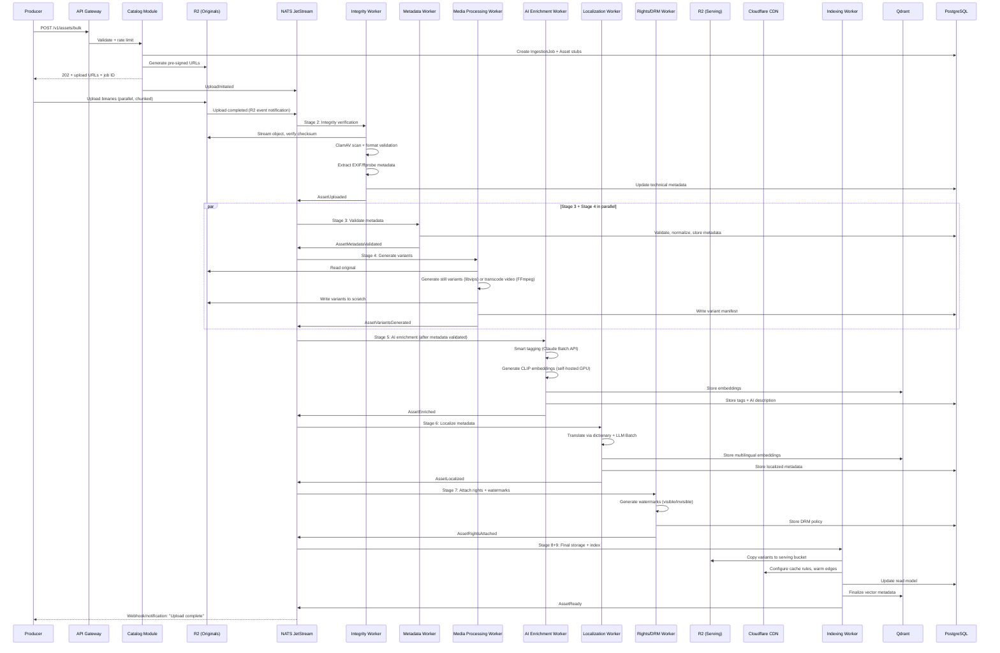

# Aura — Asset Ingestion Pipeline (Detailed Specification)

> **Scope:** End-to-end flow from the moment a producer initiates an upload to the point where
> the fully processed, localized, and renderable asset is available on the CDN edge and
> discoverable via search.
>
> **Asset types:** High-resolution stills (JPEG, TIFF, PNG, WebP, HEIF, RAW/DNG) and video
> (ProRes, H.264, H.265/HEVC, VP9, AV1).

---

## Table of Contents

1. [Pipeline Overview](#1-pipeline-overview)
2. [Stage 1 — Upload Initiation & Admission Control](#2-stage-1--upload-initiation--admission-control)
3. [Stage 2 — Binary Upload & Integrity Verification](#3-stage-2--binary-upload--integrity-verification)
4. [Stage 3 — Metadata Ingestion & Validation](#4-stage-3--metadata-ingestion--validation)
5. [Stage 4 — Media Processing & Variant Generation](#5-stage-4--media-processing--variant-generation)
6. [Stage 5 — AI Enrichment (Smart Tags, Descriptions, Embeddings)](#6-stage-5--ai-enrichment)
7. [Stage 6 — Localization of Metadata & Assets](#7-stage-6--localization)
8. [Stage 7 — Rights Attachment & DRM Preparation](#8-stage-7--rights-attachment--drm-preparation)
9. [Stage 8 — Final Storage Layout & CDN Propagation](#9-stage-8--final-storage-layout--cdn-propagation)
10. [Stage 9 — Indexing & Discoverability](#10-stage-9--indexing--discoverability)
11. [End-to-End Sequence Diagram](#11-end-to-end-sequence-diagram)
12. [Asset State Machine](#12-asset-state-machine)
13. [Error Handling & Dead Letter Strategy](#13-error-handling--dead-letter-strategy)
14. [Cost Model & Throughput Targets](#14-cost-model--throughput-targets)

---

## 1. Pipeline Overview

The ingestion pipeline is a **multi-stage, event-driven, async workflow** composed of nine
discrete stages. Each stage is decoupled via NATS JetStream, allowing independent scaling,
retries, and observability per stage.

```
┌─────────┐   ┌──────────┐   ┌──────────┐   ┌──────────┐   ┌──────────┐
│ Upload   │──▶│ Integrity│──▶│ Metadata │──▶│  Media   │──▶│    AI    │
│ Initiate │   │ Verify   │   │ Validate │   │ Process  │   │ Enrich   │
└─────────┘   └──────────┘   └──────────┘   └──────────┘   └──────────┘
                                                                 │
┌─────────┐   ┌──────────┐   ┌──────────┐   ┌──────────┐        │
│ Discover-│◀──│   CDN    │◀──│  Final   │◀──│  Rights  │◀──┌────▼───┐
│ ability  │   │ Propagate│   │ Storage  │   │  Attach  │   │Localize│
└─────────┘   └──────────┘   └──────────┘   └──────────┘   └────────┘
```

**Design principles:**
- Every stage is idempotent — safe to retry on failure.
- Every stage emits a domain event on success (and a failure event on exhausted retries).
- Assets carry an `ingestion_id` (UUIDv7) as the correlation key across all stages.
- Binary data (pixels/frames) flows through object storage (R2); only references flow through the message broker.

---

## 2. Stage 1 — Upload Initiation & Admission Control

### Purpose
Authenticate the producer, validate quota/rate limits, register the upload intent, and return
pre-signed upload URLs.

### Inputs
| Field | Source | Required |
|---|---|---|
| `producer_id` | Auth token (JWT) | Yes |
| `asset_count` | Request body | Yes |
| `assets[]` | Array of `{filename, mime_type, byte_size, checksum_sha256}` | Yes |
| `collection_id` | Request body | No (default: uncategorized) |
| `upload_mode` | Request body | No (default: `single`; options: `single`, `bulk`) |

### Processing Steps

1. **Authentication & Authorization**
   - Validate JWT via Identity module.
   - Check producer's `upload` scope (museums/3P devs have `bulk_upload` scope).
   - For API-led 3P uploads: validate API key + HMAC signature on request body.

2. **Admission Control**
   - **Quota check:** Query producer's current monthly upload count vs. plan limit (PostgreSQL).
     - Free tier: 50 assets/month.
     - Pro: 5,000 assets/month.
     - Enterprise/Museum: 100,000 assets/month.
   - **Rate limit:** Token bucket in Valkey — max 100 uploads/minute per producer.
   - **File validation (pre-upload):**
     - `mime_type` must be in allowlist (see supported formats above).
     - `byte_size` must be ≤ 2 GB per still, ≤ 50 GB per video.
     - Total batch size ≤ 500 assets per request.
   - **Reject with 429** if quota/rate exceeded; **reject with 400** if validation fails.

3. **Upload Intent Registration**
   - Create `IngestionJob` record in PostgreSQL:
     ```
     ingestion_jobs (
       id              UUIDv7 PK,
       producer_id     UUID FK,
       collection_id   UUID FK NULL,
       asset_count     INT,
       status          ENUM('INITIATED','UPLOADING','PROCESSING','ENRICHING',
                            'LOCALIZING','FINALIZING','READY','FAILED'),
       created_at      TIMESTAMPTZ,
       updated_at      TIMESTAMPTZ,
       expires_at      TIMESTAMPTZ  -- upload URLs expire after this
     )
     ```
   - Create `Asset` stub records (one per file) with status `PENDING_UPLOAD`:
     ```
     assets (
       id              UUIDv7 PK,
       ingestion_job_id UUID FK,
       producer_id     UUID FK,
       original_filename TEXT,
       mime_type       TEXT,
       expected_bytes  BIGINT,
       checksum_sha256 TEXT,
       status          ENUM('PENDING_UPLOAD','UPLOADED','PROCESSING','ENRICHING',
                            'LOCALIZING','FINALIZING','READY','FAILED','QUARANTINED'),
       upload_key      TEXT,          -- R2 object key for original
       created_at      TIMESTAMPTZ,
       updated_at      TIMESTAMPTZ
     )
     ```

4. **Generate Pre-Signed Upload URLs**
   - For each asset, generate an S3-compatible pre-signed PUT URL to Cloudflare R2.
   - Bucket: `aura-originals-{region}` (e.g., `aura-originals-us-east`).
   - Key pattern: `originals/{producer_id}/{ingestion_job_id}/{asset_id}/{filename}`.
   - Expiry: 24 hours.
   - Conditions: Content-Type must match declared `mime_type`, Content-Length ≤ declared `byte_size`.
   - For files > 100 MB: return multipart upload initialization (R2 multipart API).

5. **Response**
   ```json
   {
     "ingestion_job_id": "019...",
     "status": "INITIATED",
     "expires_at": "2026-03-11T12:00:00Z",
     "assets": [
       {
         "asset_id": "019...",
         "upload_url": "https://aura-originals-us-east.r2.cloudflarestorage.com/...",
         "upload_method": "PUT",
         "multipart": false,
         "headers": { "Content-Type": "image/tiff", "x-amz-checksum-sha256": "..." }
       }
     ]
   }
   ```

### Emitted Event
`UploadInitiated` → consumed by the upload monitoring worker (timeout detection).

---

## 3. Stage 2 — Binary Upload & Integrity Verification

### Purpose
Receive the binary file, verify integrity, scan for malware, and confirm the upload.

### Upload Path
Producers upload directly to R2 (server-side never touches the bytes in the hot path).

For **bulk uploads** (museums uploading 10,000+ assets):
- Use multipart uploads with 100 MB parts.
- Client SDK provides resumable upload with automatic retry on part failure.
- Progress tracking: producer can poll `GET /v1/ingestion-jobs/{id}` for per-asset status.

### Post-Upload Verification (triggered by R2 event notification)

1. **R2 Event Notification**
   - R2 bucket configured with event notification → NATS JetStream subject `ingestion.upload.completed`.
   - Payload: `{bucket, key, size, etag}`.

2. **Integrity Verification Worker** (consumes `ingestion.upload.completed`)
   - **Size check:** Actual bytes uploaded vs. `expected_bytes` in asset record (± 1 % tolerance for encoding overhead).
   - **Checksum validation:** Stream object from R2, compute SHA-256, compare to declared `checksum_sha256`.
     - If mismatch: mark asset `QUARANTINED`, emit `AssetIntegrityFailed` event, notify producer.
   - **Format validation:** Use `libmagic` (Go binding) to verify actual file type matches declared `mime_type`.
     - Reject if file is actually executable, archive, or undeclared format.
   - **Malware scan:** ClamAV scan on the binary.
     - Quarantine if positive: move object to `aura-quarantine` bucket, mark asset `QUARANTINED`.

3. **EXIF / Technical Metadata Extraction**
   - **Stills:** Extract via `exiftool` (called as subprocess):
     - Resolution (width × height px), DPI, color space (sRGB, Adobe RGB, P3), bit depth.
     - Camera model, lens, aperture, shutter speed (if present — relevant for photography).
     - GPS coordinates (stripped for privacy but stored as `origin_location` if producer opts in).
     - ICC color profile (preserved for accurate rendering).
   - **Video:** Extract via `ffprobe`:
     - Resolution, frame rate, duration, codec, bitrate, audio tracks, color space.
     - HDR metadata (if present — MaxCLL, MaxFALL for HDR10, Dolby Vision RPU).

4. **Update Asset Record**
   - Store extracted technical metadata in `asset_technical_metadata` JSONB column.
   - Update status: `PENDING_UPLOAD` → `UPLOADED`.

### Emitted Event
`AssetUploaded { asset_id, mime_type, dimensions, duration?, color_space, file_size }` → triggers Stage 3 and Stage 4 in parallel.

### Timeout Handling
- **Upload monitoring worker:** Periodically scans for assets in `PENDING_UPLOAD` status older than `expires_at`.
- Assets that were never uploaded: marked `EXPIRED`, pre-signed URLs invalidated.
- Producer notified via webhook/email.

---

## 4. Stage 3 — Metadata Ingestion & Validation

### Purpose
Validate, normalize, and store the producer-supplied descriptive metadata (title, description,
creator attribution, medium, dimensions, licensing preferences).

### Input Sources

Metadata can arrive via three paths:
1. **Inline with upload request** — `metadata` field in the initial POST body.
2. **Sidecar file** — A `.json` or `.csv` manifest uploaded alongside the assets (common for museum bulk imports).
3. **Post-upload API call** — `PUT /v1/assets/{id}/metadata` (interactive artists filling in details after upload).

### Metadata Schema

```
asset_metadata (
  asset_id            UUID PK FK,
  title               TEXT NOT NULL,
  description         TEXT,                    -- producer's description
  creator_name        TEXT NOT NULL,           -- artist/author attribution
  creator_id          UUID FK NULL,            -- link to registered producer (if applicable)
  creation_year       INT,                     -- year artwork was created (not uploaded)
  medium              TEXT,                    -- e.g., "Oil on canvas", "Digital photograph"
  physical_dimensions TEXT,                    -- e.g., "120cm × 80cm" (original physical size)
  provenance          TEXT,                    -- ownership/exhibition history
  culture_origin      TEXT,                    -- e.g., "French Impressionism"
  period              TEXT,                    -- e.g., "19th Century", "Renaissance"
  source_institution  TEXT,                    -- e.g., "The Uffizi Gallery"
  external_id         TEXT,                    -- museum's internal catalog number
  license_type        ENUM('VIEW_ONLY','PERSONAL_DIGITAL','COMMERCIAL_DISPLAY'),
  license_terms_url   TEXT,                    -- link to full license terms
  explicit_content    BOOLEAN DEFAULT FALSE,
  custom_tags         TEXT[],                  -- producer-supplied tags
  locale              TEXT DEFAULT 'en',       -- language of supplied metadata
  raw_sidecar         JSONB,                   -- original unprocessed metadata (audit trail)
  validated_at        TIMESTAMPTZ,
  updated_at          TIMESTAMPTZ
)
```

### Validation Rules

| Field | Rule | On Failure |
|---|---|---|
| `title` | Non-empty, 1–500 chars, no HTML/script injection | Reject |
| `creator_name` | Non-empty, 1–200 chars | Reject |
| `license_type` | Must be valid enum value | Reject |
| `creation_year` | If provided: 0–current year | Warn + clamp |
| `description` | Max 5,000 chars, sanitized (strip HTML) | Truncate + warn |
| `medium` | If provided: match against controlled vocabulary (fuzzy) | Normalize or flag for review |
| `custom_tags` | Max 30 tags, each ≤ 50 chars | Truncate list |
| `locale` | Valid BCP 47 language tag | Default to `en` |

### Normalization
- **Title/description:** Unicode NFC normalization, trim whitespace.
- **Medium:** Fuzzy match against a controlled vocabulary (e.g., "oil on canvas" → `OIL_CANVAS`, "photograph" → `PHOTOGRAPHY_DIGITAL` or `PHOTOGRAPHY_FILM`). Unmatched values kept as-is + flagged for human review.
- **Creator name:** Normalize diacritics for search (store both original and normalized forms).
- **Dates:** Normalize to ISO 8601 where applicable.

### Sidecar Manifest Processing (Bulk Uploads)

For museum/3P bulk imports that provide a CSV or JSON manifest:
1. Parse manifest, validate column headers against expected schema.
2. Match each row to an uploaded asset by `filename` or `external_id`.
3. Validate each row independently — partial success allowed (valid assets proceed, invalid ones are flagged).
4. Return a validation report: `{total: 10000, valid: 9847, warnings: 120, errors: 33, error_details: [...]}`.

### Emitted Event
`AssetMetadataValidated { asset_id, locale, has_description, has_provenance }` → triggers Stage 5 (AI enrichment depends on knowing what metadata is already present).

---

## 5. Stage 4 — Media Processing & Variant Generation

### Purpose
Generate all renderable variants of the original asset for every supported device class and
resolution tier, encode video for adaptive streaming, and extract visual preview artifacts.

### Trigger
Consumes `AssetUploaded` event (runs in parallel with Stage 3).

### 5.1 Still Image Processing

**Processing Worker:** Runs on CPU-optimized instances. Uses `libvips` (via Go binding `bimg`) for
speed and memory efficiency (libvips processes images in streaming fashion, not loading entire
files into memory — critical for 8K / 500 MP images).

#### Variant Generation Matrix

| Variant ID | Max Dimension | Format | Quality | Use Case |
|---|---|---|---|---|
| `thumb_sm` | 200 × 200 | WebP | 80 | Grid thumbnails, search results |
| `thumb_md` | 600 × 600 | WebP | 85 | Card previews, mobile lists |
| `preview` | 1200 × 1200 | WebP + AVIF | 85 | Detail view, web browsing |
| `display_fhd` | 1920 × 1080 | WebP + AVIF + JPEG | 90 | Full HD displays, phones |
| `display_4k` | 3840 × 2160 | WebP + AVIF + JPEG | 92 | 4K TVs, digital canvases |
| `display_8k` | 7680 × 4320 | AVIF + JPEG | 95 | 8K displays (Samsung Frame Pro) |
| `display_pillar` | 1080 × 3840 | WebP + AVIF | 90 | Vertical digital pillars (lobbies) |
| `print_preview` | 2400 × 2400 | JPEG | 95 | Print licensing preview |
| `original_preserved` | Original | Original format | Lossless | Archival, print fulfillment |

#### Processing Steps per Still

1. **Read original** from R2 `aura-originals` bucket (streaming, not full load).
2. **Color management:**
   - Detect embedded ICC profile.
   - For display variants: convert to sRGB (universal display compatibility).
   - For `print_preview` and `original_preserved`: preserve original color profile (Adobe RGB, ProPhoto RGB).
   - If no ICC profile: assume sRGB.
3. **Orientation correction:** Apply EXIF orientation tag, strip EXIF from output variants (privacy).
4. **Generate each variant:**
   - Resize with Lanczos3 resampling (best quality for downscaling).
   - Maintain aspect ratio — fit within max dimension bounding box, no cropping.
   - For `display_pillar`: center-crop or letterbox to target aspect ratio (configurable per asset).
   - Encode to target format(s).
   - For `thumb_sm` and `thumb_md`: generate a smart crop variant using saliency detection (libvips `smartcrop`).
5. **Generate blur hash** (BlurHash algorithm) for each variant — used as placeholder during lazy loading.
6. **Generate dominant color palette** (top 5 colors via k-means on thumbnail) — stored in metadata for UI theming.
7. **Write all variants** to R2 `aura-variants` bucket.

#### Output Storage Path
```
variants/{asset_id}/{variant_id}.{format}
  e.g., variants/019abc.../display_4k.avif
        variants/019abc.../thumb_sm.webp
```

### 5.2 Video Processing

**Processing Worker:** Runs on GPU-enabled instances (NVIDIA T4 or L4). Uses FFmpeg with
hardware-accelerated encoding (NVENC for H.264/H.265, software for AV1/VP9).

#### Video Pipeline

1. **Transcode to adaptive bitrate ladder:**

   | Profile | Resolution | Codec | Bitrate | Use Case |
   |---|---|---|---|---|
   | `v_360p` | 640 × 360 | H.264 | 800 Kbps | Low bandwidth / preview |
   | `v_720p` | 1280 × 720 | H.265 | 2.5 Mbps | Mobile, standard web |
   | `v_1080p` | 1920 × 1080 | H.265 | 5 Mbps | Full HD displays |
   | `v_4k` | 3840 × 2160 | H.265 | 15 Mbps | 4K TVs, digital canvases |
   | `v_4k_hdr` | 3840 × 2160 | H.265 (HDR10) | 20 Mbps | HDR displays (if source is HDR) |
   | `v_8k` | 7680 × 4320 | AV1 | 30 Mbps | 8K displays (future-proofing) |

2. **Segment for streaming:**
   - Generate HLS (`.m3u8` + `.ts` segments) and DASH (`.mpd` + `.m4s` segments).
   - Segment duration: 6 seconds (balance between seek granularity and request overhead).
   - Byte-range addressing for DASH (reduces segment file count).

3. **Audio processing:**
   - Normalize audio to -14 LUFS (EBU R128 standard).
   - Encode: AAC-LC 128 Kbps stereo (primary) + AAC-LC 64 Kbps mono (fallback).
   - If no audio: ambient art video — no audio track (saves bandwidth).

4. **Thumbnail extraction:**
   - Extract keyframe at 10 % duration as the default video thumbnail.
   - Generate 10 evenly-spaced preview frames for scrub preview (sprite sheet).
   - Process each keyframe through the still variant pipeline (`thumb_sm`, `thumb_md`, `preview`).

5. **HDR handling:**
   - If source contains HDR metadata (HDR10, HLG, Dolby Vision): preserve in `v_4k_hdr` profile.
   - Generate SDR tone-mapped version for non-HDR profiles using FFmpeg `tonemap=hable`.

6. **Write outputs** to R2:
   ```
   variants/{asset_id}/video/{profile}/manifest.m3u8
   variants/{asset_id}/video/{profile}/segment_000.ts
   variants/{asset_id}/video/dash/manifest.mpd
   variants/{asset_id}/video/thumbnails/sprite.webp
   ```

### 5.3 Variant Manifest Record

After all variants are generated, write a `variant_manifest` record to PostgreSQL:

```
asset_variants (
  asset_id        UUID FK,
  variant_id      TEXT,           -- e.g., 'display_4k', 'v_1080p'
  format          TEXT,           -- e.g., 'avif', 'webp', 'hls'
  width           INT,
  height          INT,
  file_size       BIGINT,
  r2_key          TEXT,           -- full object key in R2
  blur_hash       TEXT,           -- BlurHash string (stills only)
  color_palette   JSONB,         -- [{hex, percentage}, ...]
  duration_sec    FLOAT,         -- video only
  bitrate_kbps    INT,           -- video only
  codec           TEXT,           -- video only
  hdr             BOOLEAN,       -- video only
  created_at      TIMESTAMPTZ,
  PRIMARY KEY (asset_id, variant_id, format)
)
```

### Emitted Event
`AssetVariantsGenerated { asset_id, variant_count, total_size_bytes, has_video, has_hdr }` → triggers Stage 8 (CDN propagation can begin for base variants).

---

## 6. Stage 5 — AI Enrichment

### Purpose
Generate smart tags (style, mood, color palette classification), AI-written descriptions,
and vector embeddings for semantic search and visual similarity.

### Trigger
Consumes `AssetMetadataValidated` event (depends on Stage 3 completion; uses Stage 4's
`preview` variant if available, otherwise falls back to original).

### 6.1 Smart Tagging Pipeline

**Input:** `preview` variant image (1200 × 1200) or first keyframe for video.

**LLM Call — Claude Sonnet 4.6 via Batch API (50 % cost reduction):**

Prompt structure (per asset):
```
Analyze this artwork image. Return a JSON object with:
- style_tags: [up to 5 art style tags, e.g., "Impressionism", "Abstract Expressionism"]
- mood_tags: [up to 5 mood descriptors, e.g., "serene", "dramatic", "melancholic"]
- color_palette: [up to 8 dominant colors as descriptive names, e.g., "cobalt blue", "burnt sienna"]
- subject_tags: [up to 10 subject descriptors, e.g., "landscape", "portrait", "still life"]
- technique_tags: [up to 5 technique descriptors, e.g., "impasto", "watercolor wash"]
- era_estimate: "estimated era or art movement period"
- description_en: "A 2-3 sentence art-historical description of this work"
```

**Token budget:** 800 tokens max per asset (input image + prompt ≈ 1500 tokens, output ≈ 800 tokens).

**Batch processing:** Assets are queued and submitted in batches of 100 to the Anthropic Batch API.
Batch results arrive asynchronously (typically within 30 minutes for 10,000 assets).

**Fallback (circuit breaker open or budget exhausted):**
- Use a local lightweight model (BLIP-2 or SigLIP, self-hosted) for basic captioning.
- Generate only `subject_tags` and `color_palette` from computer vision (OpenCV histogram + object detection).
- Mark asset as `PENDING_FULL_ENRICHMENT` for retry when LLM budget resets.

### 6.2 AI Description Generation

For assets where the producer did **not** supply a description:
- The LLM-generated `description_en` from the tagging step becomes the primary description.
- For assets with a producer description: the AI description is stored as `ai_description` (secondary, used for search augmentation, not displayed as primary).

### 6.3 Vector Embedding Generation

**CLIP Embeddings (self-hosted GPU — NVIDIA L4):**
- Model: OpenCLIP ViT-L/14 (LAION-2B trained).
- Input: `preview` variant image (resized to 224 × 224 for CLIP).
- Output: 768-dimensional float32 vector.
- Stored in Qdrant with asset metadata as payload (for filtered vector search).

**Text Embedding (for search index augmentation):**
- Concatenate: `title + description + style_tags + mood_tags + subject_tags`.
- Embed via the same CLIP text encoder (shared embedding space with images).
- Store as a second vector in Qdrant (enables text-to-image cross-modal search).

### 6.4 Enrichment Output Storage

```
asset_ai_enrichment (
  asset_id            UUID PK FK,
  style_tags          TEXT[],
  mood_tags           TEXT[],
  color_palette       TEXT[],       -- descriptive color names
  color_hex_palette   TEXT[],       -- hex values extracted from image
  subject_tags        TEXT[],
  technique_tags      TEXT[],
  era_estimate        TEXT,
  ai_description_en   TEXT,
  enrichment_model    TEXT,         -- e.g., "claude-sonnet-4.6-batch"
  enrichment_version  INT,         -- schema version for re-enrichment
  clip_embedding_id   TEXT,         -- Qdrant point ID
  token_usage         JSONB,        -- {input_tokens, output_tokens, cost_usd}
  enriched_at         TIMESTAMPTZ,
  confidence_score    FLOAT         -- model self-assessed confidence (0-1)
)
```

### Emitted Event
`AssetEnriched { asset_id, tag_count, has_ai_description, embedding_stored }` → triggers Stage 6 (localization).

---

## 7. Stage 6 — Localization

### Purpose
Translate producer-supplied and AI-generated metadata into supported display languages and,
where applicable, generate locale-appropriate asset variants (text overlays, cultural
adaptations).

### 7.1 Supported Locales (Launch)

| Locale | Language | Priority |
|---|---|---|
| `en` | English | Primary (source language for AI) |
| `es` | Spanish | Tier 1 |
| `fr` | French | Tier 1 |
| `de` | German | Tier 1 |
| `ja` | Japanese | Tier 1 |
| `zh-Hans` | Simplified Chinese | Tier 1 |
| `ko` | Korean | Tier 2 |
| `pt-BR` | Brazilian Portuguese | Tier 2 |
| `ar` | Arabic | Tier 2 (RTL support) |
| `it` | Italian | Tier 2 |

### 7.2 Metadata Localization

**What gets translated:**
- `title` (if producer hasn't supplied locale-specific titles)
- `description` (producer-supplied or AI-generated)
- `ai_description_en` → localized AI descriptions
- `style_tags`, `mood_tags`, `subject_tags` → localized from a controlled translation dictionary (not LLM-translated per asset — too expensive)

**Translation strategy — tiered by cost:**

| Content Type | Method | Cost |
|---|---|---|
| **Tags** (style, mood, subject) | Pre-translated controlled vocabulary lookup table | Near-zero (one-time dictionary cost) |
| **Short text** (titles ≤ 200 chars) | LLM translation via Batch API (batched across assets) | Low (batch pricing) |
| **Long text** (descriptions, provenance) | LLM translation via Batch API | Medium |
| **Producer-supplied locale-specific content** | No translation needed — pass through | Zero |

**LLM Translation Prompt (batched):**
```
Translate the following art metadata from {source_locale} to {target_locale}.
Preserve art-historical terminology. Do not add or remove information.
Maintain proper nouns (artist names, place names) in their original form.

Title: {title}
Description: {description}

Return JSON: { "title": "...", "description": "..." }
```

**Tag Translation Dictionary:**
- Maintained as a static lookup table in PostgreSQL.
- Curated by domain experts (art historians) for accuracy.
- Example: `"Impressionism"` → `{ "es": "Impresionismo", "fr": "Impressionnisme", "ja": "印象派" }`.
- New tags from AI enrichment that don't exist in the dictionary are queued for human translation.

### 7.3 Localized Metadata Storage

```
asset_metadata_localized (
  asset_id        UUID FK,
  locale          TEXT,            -- BCP 47 tag
  title           TEXT,
  description     TEXT,
  ai_description  TEXT,
  translation_method TEXT,         -- 'dictionary', 'llm_batch', 'producer_supplied'
  translated_at   TIMESTAMPTZ,
  reviewed        BOOLEAN DEFAULT FALSE,  -- human review flag
  PRIMARY KEY (asset_id, locale)
)
```

### 7.4 Asset Variant Localization

For most art assets, the visual content is language-independent. However, some cases require
locale-aware variants:

- **Text-overlay artworks:** If the asset includes burned-in text (e.g., exhibition posters, infographics), the producer can upload locale-specific originals. These are processed through the full variant pipeline (Stage 4) independently per locale.
- **Cultural sensitivity flags:** During AI enrichment, if the content is flagged as potentially sensitive in certain cultural contexts (nudity norms, religious imagery), a `content_advisory` record is created per locale. Consumers in those locales see a content warning before display.

### 7.5 Localized Search Index

For each localized metadata record, generate a **locale-specific text embedding**:
- Concatenate localized `title + description + translated_tags`.
- Embed via multilingual text encoder (multilingual CLIP or multilingual-e5-large).
- Store in Qdrant with `locale` as a filterable payload field.
- This enables a Japanese user searching in Japanese to find French Impressionist paintings with Japanese-translated metadata.

### Emitted Event
`AssetLocalized { asset_id, locales_completed: ["en","es","fr",...], pending_locales: ["ar"] }`
→ triggers Stage 7.

---

## 8. Stage 7 — Rights Attachment & DRM Preparation

### Purpose
Attach licensing metadata, generate DRM artifacts (watermarks, signing keys), and configure
access policies.

### Trigger
Consumes `AssetLocalized` event (or `AssetEnriched` if localization is skipped for assets
marked as English-only).

### 8.1 License Configuration

The producer sets the license type during metadata ingestion (Stage 3). This stage
operationalizes it:

| License Type | Consumer Permissions | DRM Treatment |
|---|---|---|
| `VIEW_ONLY` | Browse in app, no download, no display on external devices | Watermarked preview only; no full-res URLs served |
| `PERSONAL_DIGITAL` | Display on personal devices (phone, tablet, home TV) | Signed URLs, device-limited (max 5 devices per license) |
| `COMMERCIAL_DISPLAY` | Display on commercial screens (lobbies, retail) | Signed URLs + invisible watermark with license ID embedded |

### 8.2 Watermark Generation

**Visible watermark (VIEW_ONLY assets):**
- Applied to `preview` and all `display_*` variants.
- Semi-transparent Aura logo overlay (bottom-right corner, 15 % opacity).
- Generated using libvips composite operation.
- Watermarked variants stored alongside originals:
  ```
  variants/{asset_id}/watermarked/{variant_id}.{format}
  ```

**Invisible watermark (COMMERCIAL_DISPLAY assets):**
- Steganographic watermark encoding the `license_id` into the pixel data.
- Algorithm: DWT (Discrete Wavelet Transform) based — survives JPEG recompression, resizing, and screen capture.
- Applied to all `display_*` variants during final storage write.
- Enables forensic tracking: if an artwork appears on an unlicensed screen, extract the watermark to identify the source license.

### 8.3 DRM Access Policy Record

```
asset_drm_policy (
  asset_id          UUID FK,
  license_type      TEXT,
  watermark_visible BOOLEAN,
  watermark_invisible BOOLEAN,
  max_devices       INT,            -- NULL for unlimited (VIEW_ONLY has 0)
  signed_url_ttl    INTERVAL,       -- e.g., '1 hour' for PERSONAL, '24 hours' for COMMERCIAL
  geo_restrictions   TEXT[],         -- ISO 3166-1 country codes where display is blocked
  created_at        TIMESTAMPTZ
)
```

### Emitted Event
`AssetRightsAttached { asset_id, license_type, watermark_applied }` → triggers Stage 8.

---

## 9. Stage 8 — Final Storage Layout & CDN Propagation

### Purpose
Organize all processed variants into the final R2 storage hierarchy, configure CDN caching
rules, and warm critical edge caches.

### 9.1 Final Storage Layout in R2

```
Bucket: aura-originals (write-once, archival)
  └── originals/{producer_id}/{asset_id}/{original_filename}

Bucket: aura-serving (CDN origin, read-heavy)
  └── v1/{asset_id}/
      ├── meta.json                          # Variant manifest (cached by CDN)
      ├── img/
      │   ├── thumb_sm.webp
      │   ├── thumb_md.webp
      │   ├── preview.webp
      │   ├── preview.avif
      │   ├── display_fhd.webp
      │   ├── display_fhd.avif
      │   ├── display_fhd.jpg               # JPEG fallback for legacy devices
      │   ├── display_4k.avif
      │   ├── display_4k.jpg
      │   ├── display_8k.avif
      │   ├── display_pillar.avif
      │   └── print_preview.jpg
      ├── video/                             # (video assets only)
      │   ├── hls/
      │   │   ├── master.m3u8               # Multi-bitrate HLS manifest
      │   │   ├── 360p/
      │   │   ├── 720p/
      │   │   ├── 1080p/
      │   │   ├── 4k/
      │   │   └── 4k_hdr/
      │   ├── dash/
      │   │   └── manifest.mpd
      │   └── thumbnails/
      │       └── sprite.webp
      └── wm/                                # Watermarked variants (VIEW_ONLY)
          ├── preview.webp
          └── display_fhd.webp
```

### 9.2 Object Migration (Processing → Serving)

1. **Copy** all finalized variants from `aura-variants` (processing scratch space) to `aura-serving` (CDN origin).
2. **Apply R2 object metadata headers:**
   - `Cache-Control: public, max-age=31536000, immutable` (variants are content-addressed, never mutated).
   - `Content-Type: image/avif`, `image/webp`, etc.
   - `Content-Disposition: inline` (display, not download).
   - Custom header `x-aura-asset-id: {asset_id}` (for CDN log correlation).
3. **Write `meta.json`** — a lightweight manifest listing all available variants, dimensions, formats, and blur hashes. CDN-cached; consumed by client apps to select the optimal variant.
4. **Delete scratch data** from `aura-variants` bucket (cost optimization — no point paying for duplicate storage).

### 9.3 CDN Configuration (Cloudflare)

**Cache rules per path:**

| Path Pattern | Cache TTL | Edge TTL | Browser TTL | Notes |
|---|---|---|---|---|
| `/v1/{id}/img/thumb_*` | 30 days | 7 days | 1 day | High-traffic thumbnails |
| `/v1/{id}/img/preview.*` | 30 days | 7 days | 1 hour | Moderate traffic |
| `/v1/{id}/img/display_*` | 365 days | 30 days | 4 hours | Immutable content-addressed |
| `/v1/{id}/video/hls/*` | 365 days | 30 days | — | Streaming segments |
| `/v1/{id}/video/dash/*` | 365 days | 30 days | — | Streaming segments |
| `/v1/{id}/meta.json` | 1 hour | 1 hour | 5 min | Mutable (new variants may be added) |
| `/v1/{id}/wm/*` | 7 days | 1 day | 30 min | Watermarked previews |

**Signed URL enforcement:**
- All paths under `/v1/{id}/img/display_*` and `/v1/{id}/video/*` require a signed URL token.
- Cloudflare Worker at the edge validates the token (HMAC-SHA256 with expiry).
- Thumbnails and previews: publicly accessible (no signing required) to enable discovery.

### 9.4 Edge Cache Warming

For **trending or newly featured assets**, proactively warm edge caches in top-traffic PoPs:

1. Identify top 20 Cloudflare PoPs by traffic volume (US-East, US-West, London, Frankfurt, Tokyo, Singapore, Sydney, ...).
2. Issue `HEAD` requests from each PoP for `thumb_md`, `preview`, and `display_fhd` variants.
3. Triggered for:
   - Assets added to curated "Editor's Pick" collections.
   - Assets trending in search (> 100 views/hour).
   - New uploads from top-tier producers (museums, verified artists).

### 9.5 Content-Negotiation at Edge (Cloudflare Worker)

A Cloudflare Worker intercepts requests to `/v1/{id}/img/*` and performs:
1. **Format negotiation:** Check `Accept` header → serve AVIF if supported, else WebP, else JPEG.
2. **Resolution negotiation:** Check `Sec-CH-Width` or `x-aura-device-width` header → select closest variant.
3. **DPR awareness:** For `2×` or `3×` displays, serve higher resolution variant.
4. **Color space:** If client sends `Sec-CH-Prefers-Color-Scheme: p3`, serve P3-profiled variant (future).

### Emitted Event
`AssetCDNReady { asset_id, serving_base_url, variant_count, cdn_warm_pops: [...] }`

---

## 10. Stage 9 — Indexing & Discoverability

### Purpose
Make the fully processed asset discoverable in search, browsable in feeds, and available
in the catalog API.

### Trigger
Consumes `AssetCDNReady` event (final stage).

### 10.1 PostgreSQL Read Model Update

Update the denormalized read model used by the Catalog API:
```
asset_read_model (
  asset_id            UUID PK,
  producer_id         UUID,
  title               TEXT,
  description         TEXT,
  creator_name        TEXT,
  license_type        TEXT,
  medium              TEXT,
  style_tags          TEXT[],
  mood_tags           TEXT[],
  subject_tags        TEXT[],
  color_palette       TEXT[],
  dominant_color_hex  TEXT,         -- for UI theming
  thumb_sm_url        TEXT,
  thumb_md_url        TEXT,
  preview_url         TEXT,
  blur_hash           TEXT,
  has_video           BOOLEAN,
  video_duration_sec  FLOAT,
  width               INT,
  height              INT,
  creation_year       INT,
  locale              TEXT,        -- primary locale
  available_locales   TEXT[],
  serving_base_url    TEXT,
  popularity_score    FLOAT DEFAULT 0,  -- updated by analytics pipeline
  created_at          TIMESTAMPTZ,
  indexed_at          TIMESTAMPTZ
)
```

- **GIN indexes** on `style_tags`, `mood_tags`, `subject_tags` for array containment queries.
- **Full-text search index** on `title || description` (PostgreSQL `tsvector`) as fallback search.

### 10.2 Qdrant Vector Index Finalization

- Confirm CLIP embedding point exists in Qdrant.
- Update payload with final metadata (tags, locale, license type, popularity_score).
- The vector is now queryable for "find similar" and semantic search.

### 10.3 Valkey Cache Priming

- Prime the Valkey read cache with the asset's read model for the top 3 locales.
- Cache key: `asset:{asset_id}:read:{locale}`.
- TTL: 24 hours (refreshed on access).

### 10.4 Feed Injection

- If the producer is "followed" by consumers, inject the new asset into followers' personalized feed queues (Valkey sorted sets, scored by timestamp).
- If the asset matches trending categories (style/mood tags), add to the global trending feed candidates.

### 10.5 Webhook Delivery (3P Developers)

- For 3P developers subscribed to `asset.ready` webhooks: deliver notification with asset metadata + preview URL.
- Webhook payload signed with HMAC-SHA256 using the developer's webhook secret.

### Final Status Update
- Asset status: `FINALIZING` → `READY`.
- IngestionJob: if all assets in the job are `READY`, job status → `READY`.
- Producer notified via push notification / email: "Your upload is complete. X assets are now live."

### Emitted Event
`AssetReady { asset_id, producer_id, ingestion_job_id }` (terminal event — no further pipeline stages).

---

## 11. End-to-End Sequence Diagram



---

## 12. Asset State Machine

```
                          ┌──────────────┐
                          │ PENDING_     │
              ┌──────────▶│ UPLOAD       │──── (expires) ──▶ EXPIRED
              │           └──────┬───────┘
     Upload   │                  │ R2 upload complete
     initiated│           ┌──────▼───────┐
              │           │  UPLOADED     │──── (integrity fail) ──▶ QUARANTINED
              │           └──────┬───────┘
              │                  │ integrity verified
              │           ┌──────▼───────┐
              │           │  PROCESSING  │──── (variant gen fail) ──▶ FAILED
              │           └──────┬───────┘
              │                  │ variants generated
              │           ┌──────▼───────┐
              │           │  ENRICHING   │──── (LLM fail, retries exhausted)
              │           └──────┬───────┘     ──▶ READY (degraded: no AI tags)
              │                  │ AI enrichment complete
              │           ┌──────▼───────┐
              │           │  LOCALIZING  │
              │           └──────┬───────┘
              │                  │ localization complete
              │           ┌──────▼───────┐
              │           │  FINALIZING  │
              │           └──────┬───────┘
              │                  │ CDN ready + indexed
              │           ┌──────▼───────┐
              │           │    READY      │
              │           └──────────────┘
              │
              │  At any stage:
              │  ──── (malware detected) ──▶ QUARANTINED
              │  ──── (producer deletes)  ──▶ DELETED
              │  ──── (DMCA takedown)     ──▶ TAKEN_DOWN
```

**State transitions are event-driven.** Each worker updates the asset status in PostgreSQL
within the same transaction as its domain write, then emits the next-stage event.

---

## 13. Error Handling & Dead Letter Strategy

### Retry Policy per Stage

| Stage | Max Retries | Backoff | Dead Letter After |
|---|---|---|---|
| Integrity Verification | 3 | 1 s → 2 s → 4 s | Move to `QUARANTINED` |
| Metadata Validation | 2 | Immediate | Flag for producer review |
| Media Processing | 3 | 30 s → 60 s → 120 s | `FAILED` + alert |
| AI Enrichment | 5 | 60 s → 2 m → 5 m → 10 m → 30 m | Promote to `READY` without tags |
| Localization | 3 | 30 s → 60 s → 120 s | `READY` with English-only |
| DRM/Rights | 2 | 10 s → 30 s | Block publishing, alert |
| CDN Propagation | 5 | 10 s → 30 s → 60 s → 2 m → 5 m | Retry from scratch |
| Indexing | 3 | 5 s → 15 s → 30 s | `READY` but not searchable, alert |

### Dead Letter Queue (DLQ)

- Each stage has a NATS JetStream DLQ subject: `ingestion.dlq.{stage_name}`.
- DLQ messages include: original event, failure reason, retry count, last error stack.
- **DLQ monitor:** A dashboard in Grafana shows DLQ depth per stage, with alerts if depth > 100.
- **DLQ replay:** Operator can replay DLQ messages after fixing the root cause (NATS JetStream replay by sequence).

### Partial Success (Bulk Uploads)

- A bulk upload job with 10,000 assets may have some assets succeed and others fail.
- The IngestionJob tracks per-asset status. The job itself transitions to `READY` when ≥ 95 % of assets are `READY`.
- Failed assets are reported to the producer with actionable error messages.
- Producer can retry failed assets individually via `POST /v1/assets/{id}/retry`.

---

## 14. Cost Model & Throughput Targets

### Per-Asset Processing Cost (Estimated)

| Stage | Still (10 MB avg) | Video (2 GB avg, 5 min) |
|---|---|---|
| R2 Storage (original) | $0.000015 | $0.003 |
| Integrity + extraction | $0.0001 (CPU) | $0.001 (CPU) |
| Variant generation | $0.002 (CPU, libvips) | $0.15 (GPU, FFmpeg) |
| AI enrichment (LLM) | $0.005 (Batch API) | $0.005 |
| AI enrichment (CLIP) | $0.0005 (GPU amortized) | $0.0005 |
| Localization (10 locales) | $0.008 (Batch API) | $0.008 |
| Watermarking | $0.0002 | $0.001 |
| R2 Storage (variants) | $0.0001 | $0.02 |
| **Total per asset** | **~$0.016** | **~$0.19** |

### Throughput Targets

| Metric | Target |
|---|---|
| Peak ingestion rate | 50,000 assets/hour (stills) |
| Video processing concurrency | 100 simultaneous transcodes (GPU pool) |
| AI enrichment throughput | 10,000 assets/hour (Batch API) |
| End-to-end latency (single still) | < 15 min (p95) |
| End-to-end latency (single 5-min video) | < 45 min (p95) |
| End-to-end latency (10,000 museum bulk) | < 4 hours (p95) |
| CDN edge availability after `READY` | < 60 s (warm PoPs) |

### Worker Scaling

| Worker Pool | Min Instances | Max Instances | Scale Trigger |
|---|---|---|---|
| Integrity Workers | 2 | 20 | Queue depth > 100 |
| Media Processing (CPU) | 4 | 50 | Queue depth > 50 |
| Media Processing (GPU) | 2 | 20 | Queue depth > 10 |
| AI Enrichment Workers | 2 | 10 | Queue depth > 500 (batch-oriented) |
| Localization Workers | 2 | 10 | Queue depth > 200 |
| DRM Workers | 2 | 10 | Queue depth > 100 |
| Indexing Workers | 2 | 20 | Queue depth > 100 |
